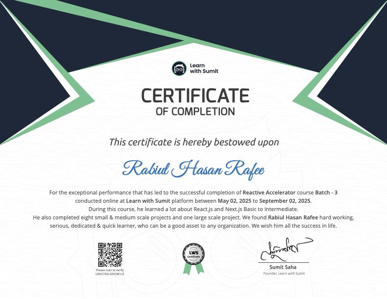
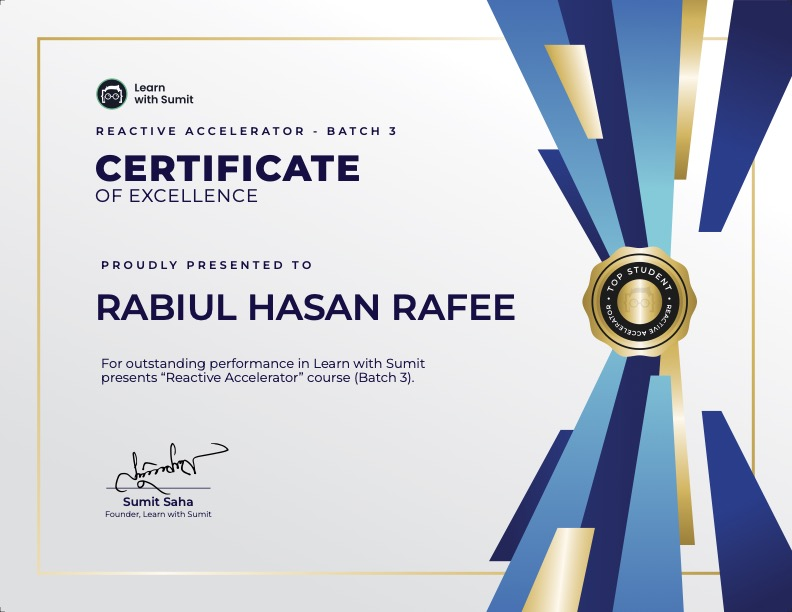
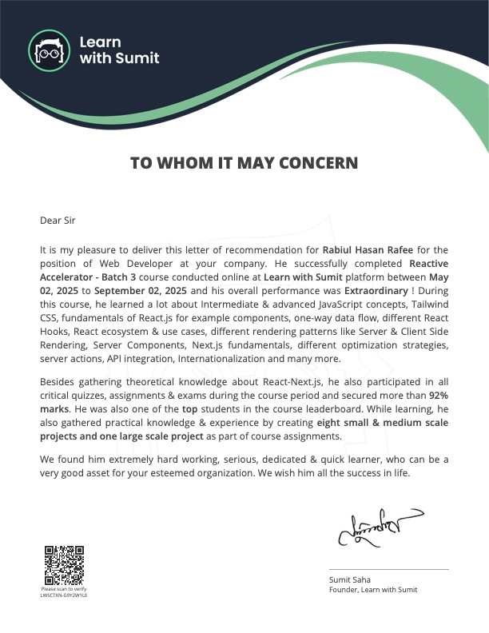
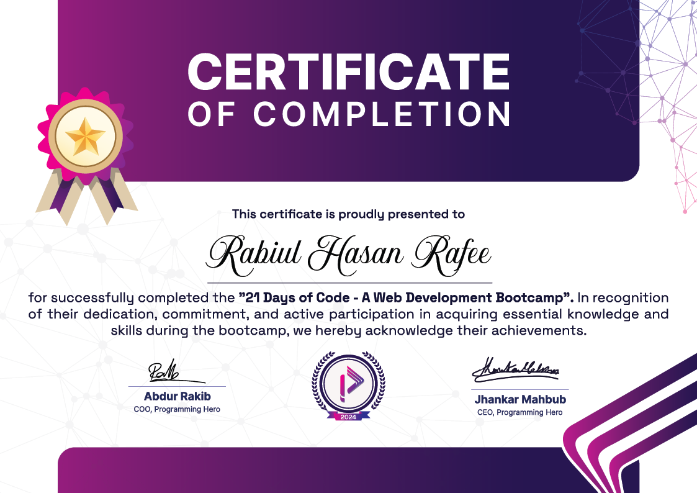
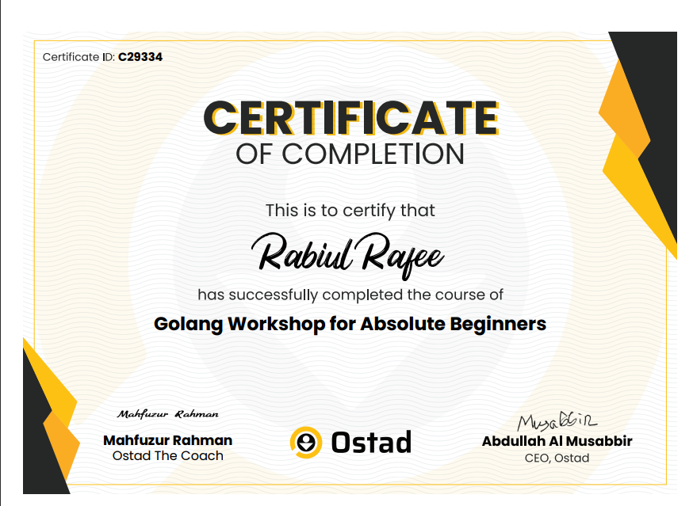
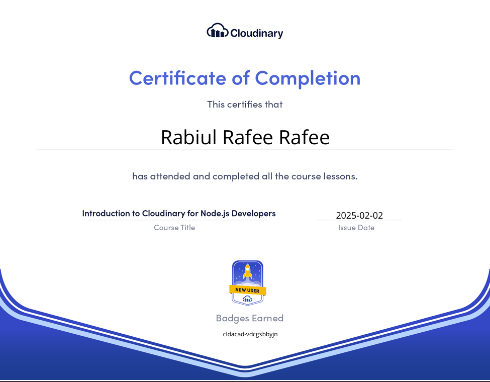
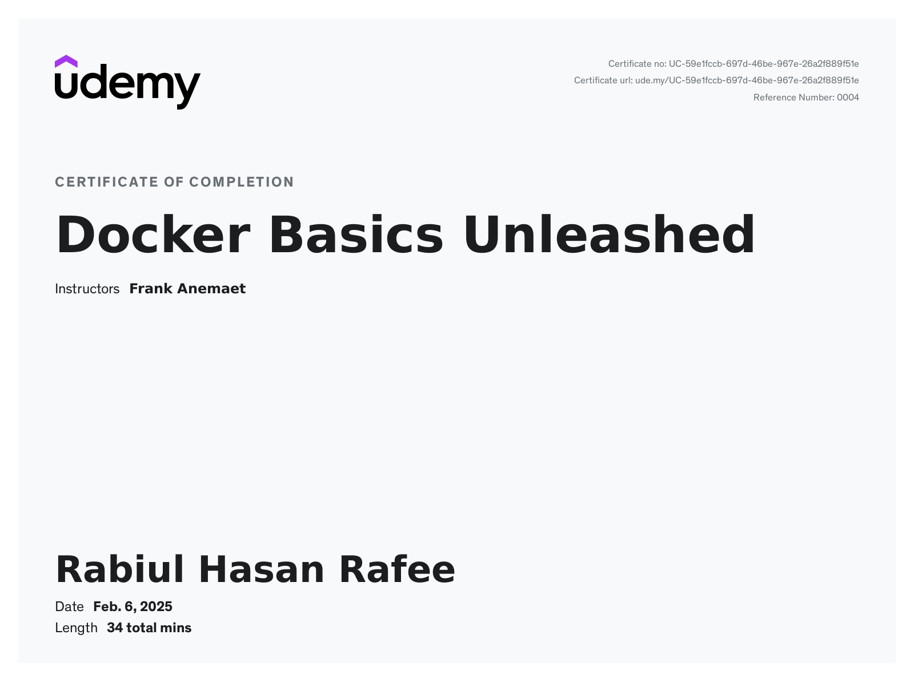

<h1 align="center"> I'm Rabiul Hasan Rafee</h1>
<h3 align="center">A passionate Full Stack (MERN) developer from Bangladesh </h3>

- 💼 Full Stack Developer at [R-Creation](https://www.r-creations.com/)
- 🔭 Former Support Software Engineer at [Neosysworld](https://www.neosysworld.com/)
- 💻 Former Trainee Full Stack Web Developer at [SM IT Solution](https://smitsolution.com.bd/)
- 🧑‍🏫 Former Instructor at [Code Segment](https://www.codesegment.org/)

---

### 🚀 What I'm Working On:

I'm deepening my skills in modern web development with a focus on:

- **MERN Stack** (MongoDB, Express, React, Node.js)
- **PERN Stack** (PostgreSQL, Express, React, Node.js)
- **Next.js**, **TypeScript**, **PHP**, **Laravel**
- **SQL** & **PostgreSQL** for backend and data-intensive applications

---

### 💬 Let’s Talk About:

If you're curious or need help with:

- **MERN Stack**, **Next JS**, **JavaScript**, **TypeScript**
- **C**, **C++**
- Or want insights from my experience as a **developer** and **instructor** — feel free to reach out!

---

- 📫 How to reach me: **rhr277@gmail.com**
- 🌐 Explore my work: [My Portfolio](https://rabiul-rafee-portfolio.netlify.app/)

  

## 🌐 Socials:

    

<h3 align="left">💻 Tech Stack:</h3>

### Languages

&nbsp;
&nbsp;
&nbsp;
&nbsp;

### Frontend Frameworks and Libraries

&nbsp;
&nbsp;
&nbsp;
&nbsp;
&nbsp;
&nbsp;

### Animation and Design

&nbsp;
&nbsp;
&nbsp;
&nbsp;

### Backend Frameworks and Tools

&nbsp;
&nbsp;
&nbsp;
&nbsp;
&nbsp;

### APIs and Tools

&nbsp;
&nbsp;

### Databases

&nbsp;

### Payment Gateways

&nbsp;

### Deployment and DevOps

&nbsp;
&nbsp;
&nbsp;
&nbsp;

---

# 📊 GitHub Stats:

  
  
  

## 🏆 GitHub Trophies

---

### 🔍 Useful Snippets

- 🌐 [NextAuth OAuth Setup in Next.js](https://gist.github.com/LaZyFee/5ed9074fac07be55ff8a9e5d1c58bb58)

---

## 🎓 Certifications

| Certificate                                        | Platform                                              | Preview                                                                                       |
| -------------------------------------------------- | ----------------------------------------------------- | --------------------------------------------------------------------------------------------- |
| **_REACTIVE ACCELERATOR_**                         | [LWS](https://learnwithsumit.com/rnext)               |                                       |
| **_REACTIVE ACCELERATOR - Excellence_**            | [LWS](https://learnwithsumit.com/rnext)               |                            |
| **_REACTIVE ACCELERATOR - Recommendation Letter_** | [LWS](https://learnwithsumit.com/rnext)               |                             |
| **21 Days of Code - A Web Development Bootcamp**   | [Programming Hero](https://web.programming-hero.com/) |                                    |
| **SQA Workshop for Absolute Beginners**            | [OSTAD](https://ostad.app/)                           |                                          |
| **Golang Workshop for Absolute Beginners**         | [OSTAD](https://ostad.app/)                           |                                       |
| **PostgreSQL**                                     | [Udemy](https://www.udemy.com/)                       |                                            |
| **TypeScript Basics**                              | [Udemy](https://www.udemy.com/)                       |                                        |
| **Cloudinary for NodeJS Developers**               | [Cloudinary](https://cloudinary.com/)                 |                            |
| **Docker**                                         | [Udemy](https://www.udemy.com/)                       |                                          |
| **JavaScript Fundamentals to Advanced**            | [Udemy](https://www.udemy.com/)                       |                       |
| **JavaScript Fundamentals for Absolute Beginners** | [Udemy](https://www.udemy.com/)                       |  |
| **JavaScript Functions**                           | [Udemy](https://www.udemy.com/)                       |                                     |
| **JavaScript Fundamentals**                        | [Udemy](https://www.udemy.com/)                       |                                  |
| **Modern JavaScript**                              | [Udemy](https://www.udemy.com/)                       |                                       |

---

## 🛠️ Projects

| Project Name          | Description                                                                                                                           | Technologies                                                                                      | Live Demo                                              | Source Code                                                 | Image                                             |
| --------------------- | ------------------------------------------------------------------------------------------------------------------------------------- | ------------------------------------------------------------------------------------------------- | ------------------------------------------------------ | ----------------------------------------------------------- | ------------------------------------------------- |
| **[Blog Web App]**    | The Blog Web App allows users to create, manage, and share blog posts with authentication, image uploads, and dynamic browsing.       | React, Node.js, Express, MongoDB, Mongoose, Multer, JWT, Zustand, Swiper, Axios                   | [Live](https://blog-web-appx.netlify.app)              | [GitHub](https://github.com/LaZyFee/Blog_app)               |        |
| **[Jerin's Parlour]** | A parlour management app where customers can book, pay, and review services, with an admin portal for managing services and payments. | React, Vite, Tailwind CSS, Axios, Zustand, Passport.js, Node.js, Express, MongoDB, Stripe, PayPal | [Live](https://jerins-parlour-server-iota.vercel.app/) | [GitHub](https://github.com/LaZyFee/jerins-Parlour-Server)  |   |
| **[Doctor's Portal]** | A full-stack appointment booking system where users can schedule and pay for services, with admin functionalities for management.     | React, Tailwind CSS, React-Query, Node.js, Express, MongoDB, Firebase, Stripe, NodeMailer         | [Live](https://doctors-portal-mern.netlify.app/)       | [GitHub](https://github.com/LaZyFee/Doctors-portal-client)  |   |
| **[ChitChat]**        | A real-time chat application with one-on-one and group chats, file sharing, and WebSocket communication.                              | React, Node.js, Express, MongoDB, Zustand, Three.js, Vanta.js, Socket.io, Axios                   | -                                                      | [GitHub](https://github.com/LaZyFee/ChitChat-Client-side)   |                |
| **[Expense Tracker]** | A web app to track and manage expenses, built with the MERN stack and includes data visualization.                                    | React, Tailwind CSS, Zustand, Node.js, Express, MongoDB, Recharts                                 | [Live](https://expensetrackerwebappx.netlify.app/)     | [GitHub](https://github.com/LaZyFee/Expense-Tracker-Client) |  |
| **[ToDo]**            | A Todo web app with authentication, CRUD operations, and theme toggle support.                                                        | React, Tailwind CSS, Node.js, Express, MongoDB, Zustand                                           | [Live](https://todowebappx.netlify.app/)               | [GitHub](https://github.com/LaZyFee/TodoWebApp)             |                        |

---
